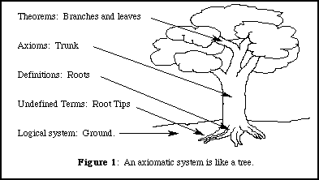

An axiomatic system is made up of a collection of undefined terms, definitions using the undefined terms and axioms which work as rules for how the defined or undefined objects behave.  This is very useful, since it allows us to replace a difficult task (like trying to define a set) with the easier task of defining how it behaves.  Below we give several examples of axiomatic systems, including those establishing sets and the natural numbers.

## Simple Example: Axioms for Atoms and Bonds

As a simple example, consider the following set of axioms for unknowns consisting of atoms and bonds.

* Axiom 1: Every atom has at least two bonds
* Axiom 2: Every bond has at least two atoms
* Axiom 3: There exists an atom

Now assuming that these axioms hold, what can we prove about atoms and bonds?  By combining the axioms, we can show, for example, that at least two bonds exist.  Statements that we can prove by combining axioms together are called theorems.  The associated arguments are called proofs.

**Theorem 1:** There exists at least two bonds.

**Proof:** By Axiom 3 there is an atom.  By Axiom 1, this atom has at least two bonds.  

Once we have a theorem, we can use it in conjunction with other Theorems and Axioms to prove new theorems.

**Theorem 2:** There exists at least two atoms.

**Proof:** By Theorem 1, there exists at least one bond.  By Axiom 2, this bond has at least two atoms.  

## The Peano Axioms

As a more complicated example of an axiomatic system, we can think of the natural numbers (starting with $$1$$).  The undefined terms here are natural numbers and the axioms are:

* Axiom 1: There is a number $$1$$
* Axiom 2: If $$n$$ is a natural number, then there exists a natural number $$n+1$$, called the successor of $$n$$
* Axiom 3: $$1$$ is not the successor of any number
* Axiom 4: If $$m$$ and $$n$$ are different natural numbers, then $$m+1$$ and $$n+1$$ are different natural numbers
* Axiom 5: If for each natural number $$n$$ we have a logical statement $$P(n)$$, where $$P(1)$$ is true, and $$P(n)$$ being true implies $$P(n+1)$$ is true, then $$P(n)$$ is true for all natural numbers $$n$$.

Within this axiomatic system, one can establish the existence of the natural numbers  where    The last axiom, Axiom 5, is a little bit more mysterious.  It works to distinguish the natural numbers from other number systems, like the integers, or the real numbers.  When we use Axiom 5 to prove a theorem we call it proof by induction, leading to some clever puns.

> A woman in liquor production
> Owns a still of exquisite construction.
> The alcohol boils
> Through magnetic coils.
> She says that it's "proof by induction."

## The Zermelo-Fraenkel Axioms

The Zermelo-Fraenkel (ZF) axioms establish a rigorous way to work with sets.  Here the undefined term is a set and indeed everything we work with is a set, including elements!

* Axiom 1: Two sets are the same if they have the same elements
* Axiom 2: Given two elements $$\{a\}$$ and $$\{b\}$$, there is a set $$\{a,b\}$$ whose elements are precisely $$a$$ and $$b$$
* Axiom 3: Given a logical statement $$P(a)$$ defined for each element $$a$$ in a set $$A$$, we can form the subset consisting of elements for which $$P(a)$$ is true
* Axiom 4: Given a set $$z$$, we can form the set $$\bigcup z = \{x: \exists y\in z\ \text{s.t.} x\in y\}$$
* Axiom 5: Given a set $$z$$, we can form the power set $$\mathcal P(z)$$ whose elements are the subsets of $$z$$
* Axiom 6: There exists an infinite set
* Axiom 7: Given a function $$f: z\rightarrow y$$ there is a set $$\{f(x): x\in z\}$$
* Axiom 8: Any set $$z$$ has an element $$y$$ such that $$z$$ and $$y$$ have no elements in common 

