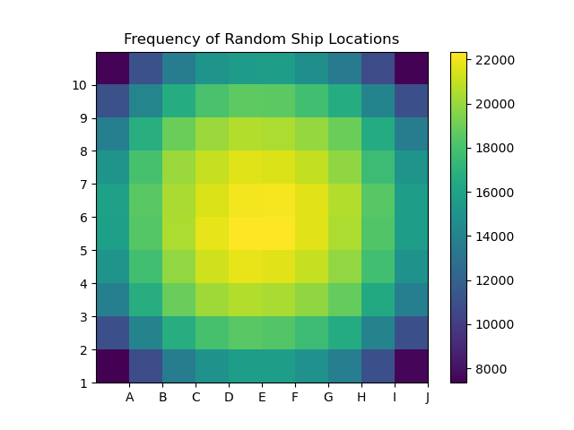

Combinatorics is the mathematical study of how we count stuff.&nbsp; In your Battleship homework, you were faced with the challenge of counting the number of ways you can place a 2x1 ship (the destroyer) on a 10x10 board, as well as a 3x1 ship (the submarine or the cruiser) on a 10x10 board.&nbsp; Even more challenging, you were tasked with counting the number of ways that you could place <strong>both</strong> a 2x1 and a 3x1 on a 10x10 board.&nbsp; Whether you did so explicitly or subconsciously, you likely had to use some basic mathematical tools which come from combinatorics in order to achieve your goal.

You also studied the most likely spots that you would find a 2x1 placed on a 3x3 board.&nbsp; In order to get the associated probabilities, we had to consider (1) the total number of different possible positions for that 2x1 ship and (2) the frequency that those positions included a certain cell.&nbsp; Certainly the calculations would become much more complicated on the full-sized 10x10 board with more than one ship!&nbsp; In the image above, your professor Riley used a computer to randomly place 100000 full battleship fleets and recorded the frequency that each particular space was occupied.&nbsp; Again we see that randomly placed ships have a tendency to find their way toward the center of the board.&nbsp;&nbsp;

<h2>Using symmetry</h2>

One tool in our mathematical toolbox that we use very often is <strong>symmetry</strong>.&nbsp; Take for example the problem of placing a single 2x1 ship on a 10x10 board.

<ul>
    <li>By symmetry, the number of ways we can place it vertically is the same as the number of ways we can place it horizontally.&nbsp; Thus we need only count the horizontal placements, and then multiply our answer by 2.</li>
    <li>By symmetry, the number of horizontal placements will be the same for any row, so we need only count the number of horizontal placements in a single row, and then multiply that answer by the number of rows 10.</li>
    <li>It's easy to count the number of horizontal placements in a single row: its 9</li>
</ul>

Putting this all together, we get that the total number of placements is

Do you see how we reduced the problem again and again by symmetry?

The same sort of calculations will work for placing a 3x1 ship.&nbsp; The only thing which changes will be the number of ways we can place it horizontally in a single row (which is 8) so the total number of placements is

<h2>Other combinatorial goodies</h2>

The toughest problem on the homework was figuring out how to place a 3x1 and a 2x1 together on the board.&nbsp; To use this, we can leverage some more basic mathematical ideas having to do with counting.

One useful idea is a rule for <strong>combinations</strong>:

<ul>
    <li>If I have a collection of  different cards and a collection of  different marbles, then the number of possible ways of picking a combination consisting of one card and one marble is&nbsp;</li>
</ul>

Of course, we can apply this to more than cards and marbles!&nbsp; Instead of cards, we could think of the was that we can place the 3x1 ship and instead of marbles we can think of the number of ways we can place the 2x1 ship.&nbsp; Then the number of ways that we can choose a combination of placing the 3x1 ship and the 2x1 ship.&nbsp; Our rule above then suggests this is

However, <strong>this isn't quite right</strong>&nbsp;because where we place our 3x1 ship restricts where we can place our 2x1 ship!

So to get our correct answer, we need to subtract all of the placement combinations that we just counted which were <strong>illegal</strong> because the ships overlapped.&nbsp; Thus we have reduced the problem to counting the number of ways we can place the 3x1 on the board and the 2x1 on the board in an overlapping way.

&nbsp;

Once we place the 3x1 down on the board, to place our 2x1 illegally we can either have it completely on top of our 3x1 in 2 different ways, or else hang over by one into an adjacent cell.&nbsp; Thus the number of illegal placements will depend on the number of adjacent cells, which varies depending on whether our 3x1 is on the boarder of the board or not!

<ul style="list-style-type: circle;">
    <li>CASE 1: our 3x1 is not on the boarder of the board.&nbsp; Then we can place the 2x1 in 10 different ways illegally.</li>
    <li>CASE 2: our 3x1 is lying broad-side to the edge of the board, but not in a corner.&nbsp; Then we can place the 2x1 in 7 different ways illegally</li>
    <li>CASE 3: our 3x1 is on the side of the board at its tip. Then we can place the 2x1 in 9 different ways</li>
    <li>CASE 4: our 3x1 is in a corner.&nbsp; Then we can place the 2x1 in 6 different ways.</li>
</ul>

How many ways can CASE 1 happen?&nbsp; That's the same as the number of ways we can place a 3x3 ship into a 8x8 board, which is 6x8x2=96.

How many ways can CASE 2 happen?&nbsp; By symmetry, we just have to check out one side and then multiply by 4 for the number of sides.&nbsp; Thus the answer is 6x4=24 ways.

How many ways can CASE 3 happen?&nbsp; By symmetry, we just have to check out one side and then multiply by 4 for the number of sides.&nbsp; So it's 8x4=32 ways.

How many ways can CASE 4 happen?&nbsp; Two different ways in each corner with four corners means 2x4=8 ways.

Thus the number of illegal cases is

&nbsp;

This gives us the total number of legal board arrangements:

