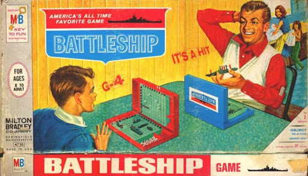
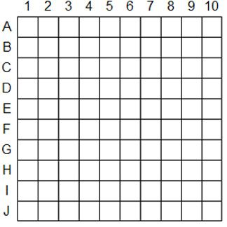

## Introduction

Battleship is a world-famous game originating as a paper-and-pencil game around the time of World War I in the 1930's before being released in it's more familar modern form by Martin Bradley in the 60's.  Most likely, this is a game that you have played more than once when you were younger, though if you are like me then it's been a while!

In Battleship, opposing players secretly arrange their ships on a  grid.  Then the players alternate making guesses of the locations of their opponents ships, attempting to get enough *hits* to sink the enemy fleet.  Are there good strategies for where to place the ships?  What about strategies for picking locations to fire?  It's up to you to find out!

### Rules

I know, I know, it's been a while!  Or maybe you've never played Battleship before, in which case you're in for a treat!  Take a moment to review the basic rules of Battleship.

* Each player should draw two $$10\times 10$$ grids.  Label the rows with the letters A-J and the columns 1-10, as pictured below.

* Next, each player should secretly fill in a $$5\times 1$$ with C's for a carrier, a $$4\times 1$$ with b's battleship, a $$3\times 1$$ with s's for submarine, a $$3\times 1$$ with c's for cruiser, and a $$2\times 1$$ with d's for destroyer.  You must keep the first grid hidden from your partner the entire game!
* Next, each player takes turns being the attacking and defending player, respectively.  The attacking player guessing spaces by specifying a particular letter/number combination.  Their opponent must respond with whether the guess is a 'hit' (if there is a ship on the space) or a 'miss' if there is not a ship on the space.
* The attacking player then records the result with an H or an M on their second grid to record the result.  Likewise, the defending player should mark the board containing their ships to indicate where the shots have been fired.
* If the attacking player manages to cover up all spaces for any particular ship, the ship is considered 'sunk' and the defender must say that a ship has been sunk.
* The first player to sink all of their opponents ships wins.

