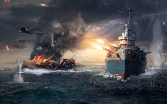

The results of the Battleship Commander Competition are in!  Your mathematical prowess, strategic skill, and clever commanding has led to this moment.  Each algorithm was tested against $$10,000$$ randomly generated Battleship fleets.  I am very pleased to say that all of the algorithms that you came up with compared very favorably in comparison to a completely random algorithm, which on average takes approximately $$59.82$$ shots per Battleship fleet.  A summary of the results are below.  Note: if your team is not listed, it was disqualified for not having a sufficiently explicit algorithm.

| team name  | average number of shots |
| ---------  | ----------------------- |
| Bubbles               | 55.2 | 
| **Empty Set**         | **46.5** | 
| Kowtch                | 49.9 | 
| PDFJ$$^3$$            | 49.7 | 
| TNRR                  | 65.9 |
| Team Mo               | 51.3 |
| The Left              | 49.7 |
| **The Pink Panthers** | **49.6** | 
| The Smash Bros        | 51.4 | 
| The Three Musketeers  | 52.3 |
| Tic-Tac-Stub Your Toe | 51.1 |
| Random Algorithm      | 59.8 |

### The best strategy this year

This year's top strategy comes from the group **Empty Set**, whose members found an excellent dynamic firing algorithm which continuously calculates the highest probability space to look for the next ship.  They randomly simulate placing the unsunk ships in the board in ways that avoid the squares that have been shot at.  By simulating the placement of ships thousands of times, they can obtain a good estimate of the probability of a ship being in a particular location.  Then they fire at the most probable location.  The details of their strategy can be found in their excellent write-up here [winning-strategy.pdf](winning-strategy.pdf).

### The runner up

The winning strategy this year beat out the other strategies by a good margin, but the race for second place was extremely close, with the second contender coming with $$0.1$$ shos in from the $$10000$$ game average.  The second place team was **The Pink Panthers**, whose strategy was to switch between a collection of four different static firing algorithm grids, depending on the average length of the remaining ships.

