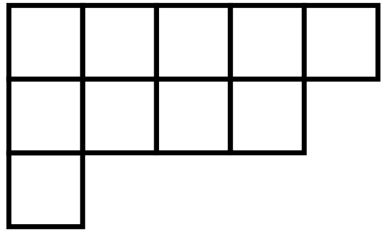
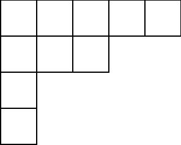

For this homework, we will rely on the following two definnitions.

**Definition 1:** A **composition** of a positive integer $$n$$ is a sequence of integers $$(a_1,a_2,\dots,a_k)$$ all greater than $$0$$ which add up to $$n$$.  The integer $$k>0$$ is called the length of the composition.

**Definition 2:** A **partition** of a positive integer $$n$$ is a composition $$(a_1,a_2,\dots,a_k)$$ of $$n$$ satisfying $$a_1\geq a_2\geq\dots\geq a_k$$.

For example, $$(1,3,1)$$ and $$(3,1,1)$$ are both compositions of $$5$$, but only the second one is a partition.

### Problem 1

Fill in the missing values in the following table.  Make sure to carefully show your work.

| $$n$$ | number of compositions | number of partitions |
| ----- | ---------------------- | -------------------- |
|   1   |          1             |          1           |
|   2   |          2             |          2           |
|   3   |          4             |          3           |
|   4   |                        |                      |
|   5   |         16             |                      |
|   6   |                        |                      |

### Problem 2

Let $$A$$ be the set of partitions of $$2021$$ and let $$B$$ be the set of composition of $$2021$$.  Which set has larger cardinality?  Carefully explain.

### Problem 3

* (A) List the partitions of $$25$$ whose first entry is 20.
* (B) List the partitions of $$25$$ whose length is 20.

### Problem 4

Graphically, partitions can be represented by a **Young diagrams**.  A young diagram is a sequence of empty squares left-aligned on top of each other.
For a partition $$(a_1,a_2,\dots,a_k)$$, the number of boxes in the $$j$$'th row from the top is exactly $$a_j$$.

**Example:** The Young diagram corresponding to the partition $$(5,4,1)$$ of $$10$$ is

**Example:** The Young diagram corresponding to the partition $$(5,3,1,1)$$ of $$10$$ is 

* (A) Draw the Young diagrams for all of the partitions of $$4$$.
* (B) Draw the Young diagrams for all the partitions of $$10$$ whose first entry is $$6$$.
* (C) Draw the Young diagrams for all the partitions of $$10$$ whose length is $$6$$.
* (D) Can you find a relationship between the Young diagrams pictured in (B) and (C)?

### Problem 5

Use Young diagrams to establish a bijection between the sets

$$A = \{x | \text{$x$ is a partition of $40$ of length $20$}\}$$

$$B = \{x | \text{$x$ is a partition of $40$ whose first entry is $20$}\}$$

This shows that $$A$$ and $$B$$ are the same size, even though we don't know what that size actually is!

