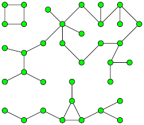

Recall that a [graph](intro-to-graphs) is a collection of points called *vertices* and curves called *edges* which connect different vertices.
A graph is called **disconnected** if you can draw it as two or more smaller graphs, where thre are no edges joining the subgraphs together.
Equivalently, a graph is called disconnected if there are nodes in the graph which are not joined together by some sequence of edges.
A graph is called **totally disconnected** if there are no edges at all!

In this assignment, we will consider the problem of whether there is a Micro Robots board whose graph is totally disconnected.
To approach this problem, we will try to use the Problem Solving Strategy of [Toy Examples](https://wcasper.github.io/math180fall2021/modules/strategies/strat-toy) consisting of Micro Robots boards of smaller sizes.  For example, we could imagine a $$3\times 3$$ board using just the numbers $$1$$ through $$3$$ and the colors red, blue, and yellow.  An example might be

| R1 | B2 | Y3 |
| Y2 | R2 | B1 |
| R3 | Y1 | B3 |

Note that in order for this to be a true Micro Robots board, each color and letter combination must occur exactly one time!

## Problem 1

Imagine you are building a $$2\times 2$$ Micro Robots board, which uses just two colors (red and blue) and two numbers ($$1$$ and $$2$$).
* (A) Is it possible for the associated graph to be disconnected?  If it is, give an example.  If not, then explain why not.
* (B) Is it possible for the associated graph to be totally disconnected?  If it is, give an example.  If not, then explain why not.

## Problem 2

Show that there is a $$3\times 3$$ Micro Robots board which uses the colors red, blue, and yellow and the numbers $$1$$-$$3$$ whose graph is totally disconnected.
Did you have a particular strategy to build this graph?

## Problem 3

Show that there is a $$5\times 5$$ Micro Robots board which uses five different colors (pick what colors you like) and the numbers $$1$$-$$5$$ whose graph is totally disconnected.
Did you have a particular strategy to build this graph?

## Problem 4

Is there a $$4\times 4$$ Micro Robots board which uses four different colors (pick what colors you like) and the numbers $$1$$-$$4$$ whose graph is totally disconnected?
If so, give an example.  If not, then explain why not.

## Problem 5 (Challenge)

* (A) Try to construct an example of a full $$6\times 6$$ Micro Robots board whose graph is totally disconnected.  If you are able to, then show it!  If not, then describe some of the challenging parts of creating the desired board.
* (B) Now imagine $$7\times 7$$, $$8\times 8$$, $$9\times 9$$, $$10\times 10$$ Micro Robots boards, or even larger micro robots boards.  Based on your experience so far, do you have a guess about for what dimensions we might be able to find boards with totally disconnected graphs?

