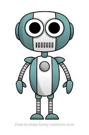

Please create a discussion post answering the following questions.  Also number your responses so that it's clear which question you are answering.  After the assignment is due you will be tasked with giving feedback to two other students responses.  Note that you will not be able to review other students' responses until after you post.

* What interesting questions do you have about the game Micro Robots?
* On the boards that you saw, was it always possible to get from one square of the board to another space on the board?
* On a given board, how do we think about the problem of whether we can reach the goal marker from a fixed starting square?
* Suppose that you want to reach the goal marker from a chosen starting square via the shortest possible route.  How do  you search for the route?  What can you do to verify that this really is the shortest route?

