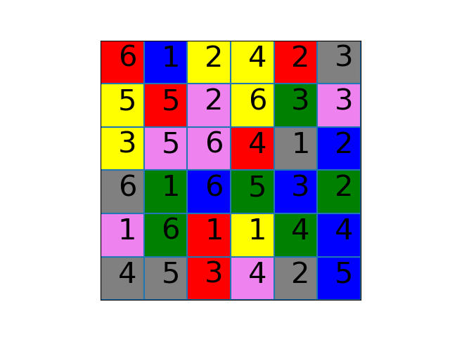
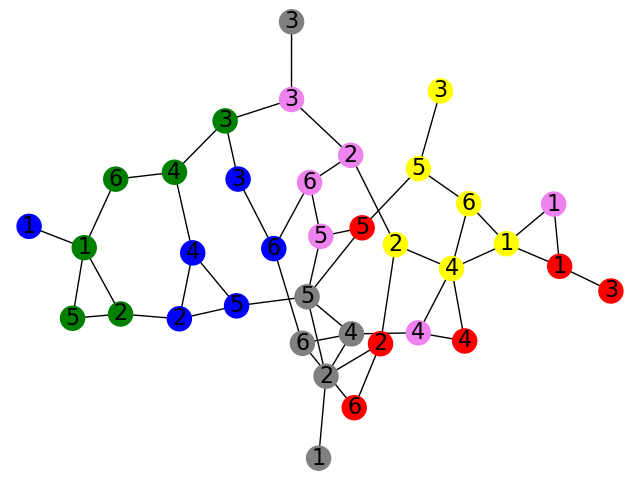

A full Micro Robots board consists of four 3x3 cards which, when put together into a square, form a 6x6 grid.  Each of the nine entries on a card has one of six colors and a number between one and six.  Furthermore, when arranged into the full 6x6 grid, each color and number combination occurs exactly one time.  For example, there will be exactly one red 4 tile and exactly one blue 2 tile.

## Problem 1

Using the Micro Robots board shown below, we constructed the associated graph.  [Caution: the layout below is misleading, as the red and gray six are connected, but neither is actually connected to the gray 2].

1. What do the vertices of the graph correspond to?
2. What about the edges?
3. The graph is connected, so what does that tell us?

## Problem 2

In a graph $$G$$, the distance between two vertices is the shortest path starting at one vertex and ending at another.
The **diameter** of a connected graph is the largest distance between any two points of the graph.

1. Suppose you have a connected graph with $$5$$ vertices.  What can the largest value of the diameter be?
2. Suppose you have a connected graph with $$5$$ vertices.  What can the smallest value of the diameter be?
3. Determine the diameter of the graph in Problem 1.  What does this represent, in terms of the game Micro Robots, using this board?
4. If I wanted to make a round of the game as hard as possible, what squares would I choose for the robot's starting point and the robots goal?  Of course "hardest" means different things to different people.  Explain why your choice is the hardest.

## Problem 3

Create a fixed Micro Robots board (ignoring shuffling or rotation) where it is possible for the robot to get stuck: where for a certain starting point and ending goal, the robot will be unable to get to the goal from the start.  Make sure that your board has each color and letter combination occurring exactly one time!  Your solution should include

* A picture of the board
* An indication which starting point and end goal is not possible on your board
* A detailed explanation why the robot can't make it to the goal

## Problem 4

For the Micro Robots board you created in Problem 3, create a drawing of the associated graph.  What property of the graph tells us that it is possible for the robot to get stuck?

## Problem 5

Create a fixed Micro Robots board (ignoring shuffling or rotation) where the robot can move from any position to any other position in two or less moves.  Explain in detail why you know that the robot is able to do this in your example.

## Problem 6

Suppose somebody hands you four $$3\times 3$$ cards which form a Micro Robots board.
1. Determine the total number of possible ways that we can arrange the cards into a board.  Don't forget about rotations!
2. Give an example of two different arrangements of the board that end up giving you the *same* graph.
2. Determine how many of the different arrangements that you found in the previous part result in a *distinct* graphs.

