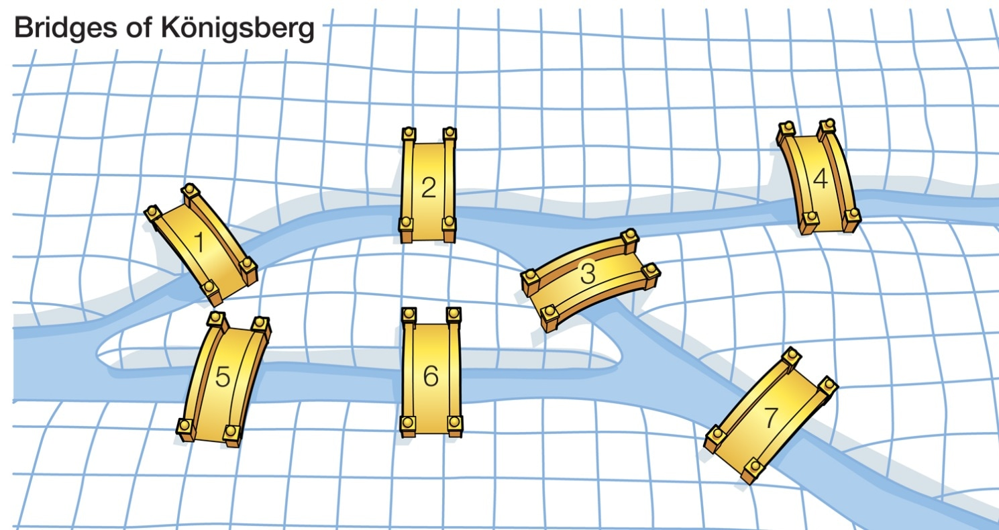
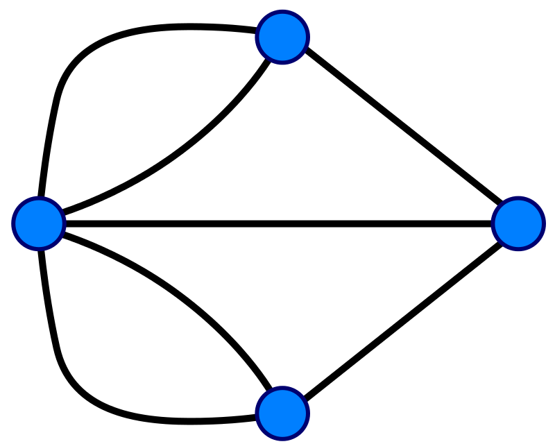
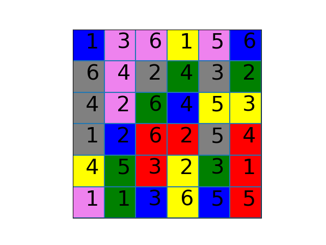
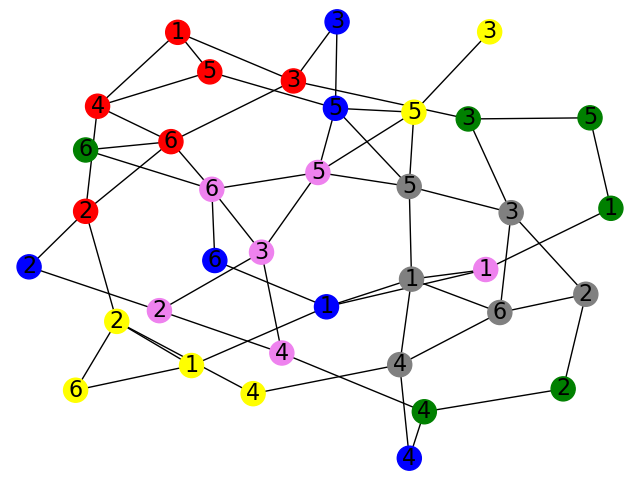

<h2 style="text-align: center;">Introduction to Graphs</h2>

A <strong>graph</strong> is a mathematical construction consisting of a collection of little round spots called <strong>vertices</strong> connected together by straight lines called <strong>edges</strong>.&nbsp; It turns out that graphs are a very natural and wonderful way of representing numerous real-world phenomena, including electrical networks, social networks, complicated atomic structures, and biological data.

<h2>The Konigsberg Bridge Problem</h2>

In the picture above, we have a cartoon version of a very famous problem solved by Euler in 1736.&nbsp; The question he answered is the following.

Is there a way to cross every single bridge in Konigsberg without crossing any bridge more than once?

In order to analyze this problem, Euler visualized this problem as a graph theory problem.&nbsp; He let the various bodies of land be represented by vertices, where the bridges are connected by edges.&nbsp; This produces a graph consisting of four vertices and seven edges as pictured below.

Each vertex (the blue circles) represents one of the land masses in the picture above.&nbsp; The edges each correspond to a bridge.&nbsp; For this reason, this particular graph is often called the <strong>Konigsberg graph</strong>.&nbsp; The problem then is to find a path on the Konigsberg graph which crosses every single edge once and only once.&nbsp; Nowadays, paths on graphs which pass through every edge exactly one time are called <strong>Eulerian paths</strong>.

<h2 style="text-align: left;">Solving the Konigsberg Bridge Problem</h2>

To solve the Konigsberg bridge problem, Euler imagined travelling on a path on the Konigsberg graph which traveled across every edge exactly one time.&nbsp; He realized that on such a path, except for possibly the vertices that the path begins and ends on, every time he entered a vertex he would have to leave again <em>by a different edge then the one he came in on</em>.&nbsp; Therefore for all but possibly two of the vertices, there should be an even number of edges touching&nbsp; each vertex! The Konigsberg graph has more than two vertices with an odd number of edges, so it cannot have such a path.&nbsp; Thus there is no such desirable path through the city of Konigsberg!

<h2>Using Graphs in Micro Robots</h2>

Graphs provide us with a natural way to study the game Micro Robots.&nbsp; Think for example about the following Micro Robots board.

Let's try to answer the following question.

Is there a way for the robot to move from the <strong>Violet 4</strong> square to the <strong>Yellow 3</strong> square while passing through <strong>Yellow 6</strong>?

A solution seems very tricky!&nbsp; After trying for a while and failing, we might even be convinced that there isn't one.&nbsp; However, by understanding the game board as a graph, we can make much better progress!

We think of each colored box as a <strong>vertex</strong>, obtaining a total of <strong>36 vertices</strong>.&nbsp; Then we create a <strong>graph</strong> by connecting two <strong>vertices</strong> with an <strong>edge</strong> when the robot can move between the corresponding boxes in a single move.&nbsp; In other words, <strong>vertices</strong> are connected when both of the following conditions are satisfied

<ul>
    <li>the corresponding boxes are in the same row or column</li>
    <li>the corresponding boxes have the same color or number</li>
</ul>

For the game board above, this produces the following graph.

Here, we have labelled the vertices according to the colored boxes that they correspond to in the board.&nbsp; This graph version of the board is extremely useful, since it allows me to answer some otherwise complicated questions very simply.&nbsp; For example, from this view we see we can move in the following way to go from the <strong>Violet 4</strong> square to the <strong>Yellow 3</strong> square while passing through <strong>Yellow 6</strong> in between:

<strong>Violet 4</strong> &nbsp;<strong>Violet 3</strong> <strong>Violet 2</strong> <strong>Blue 2</strong> <strong>Red 2</strong> <strong>Yellow 2</strong> <strong>Yellow 6</strong> 

<strong>Yellow 1</strong> <strong>Blue 1</strong> <strong>Gray 1</strong> <strong>Gray 3</strong> <strong>Gray 5</strong> <strong>Yellow 5</strong> <strong>Yellow 3</strong>

A very complicated path, but it exists!

Notice above that the graph is <strong>connected</strong>.&nbsp; This means there is always some path connecting any vertex to any other vertex.&nbsp; When the graph can be separated out into multiple different components that are not connected by any edges, the graph is called <strong>disconnected</strong>.&nbsp;&nbsp;

<h2 style="text-align: left;">Some Interesting Questions</h2>

Here we reflect on some interesting questions that a bright student might think about on a nice, sunny day.&nbsp; You are not required to answer any of these unless otherwise stated.

<ol style="list-style-type: upper-roman;">
    <li>Can any kind of graph with 36 vertices be made from some kind of Micro Robots game board?&nbsp; If not, what kinds of graphs can we make?</li>
    <li>Is it possible to find a fixed Micro Robots game board whose corresponding graph is disconnected?</li>
    <li>Is it possible to create a Micro Robots game board whose corresponding graph has an Eulerian path?&nbsp; What does this mean in terms of the board itself?</li>
</ol>

