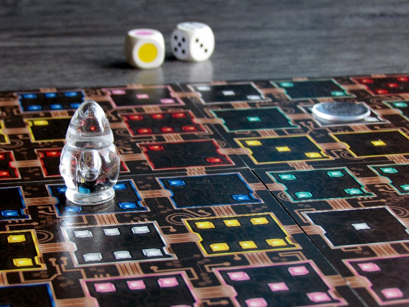

## How to Play
* Assemble the four 3x3 card panels into a single 6x6 board
* Roll both the colored die and numbered die to determine the starting position
* Roll again to determine the goal position
* Now all players race to determine a path the robot can take from the starting position to the goal position using a sequence of legal moves.  A legal move is where the robot moves vertically or horizontally from its current position to a new position which has either the same color or the same number as its previous position.  The position may not be adjacent!
* Once you have a path, you must shout out the number of moves it takes.  If you were the first to shout, and can demonstrate a legal path from the start to the finish using that number of moves you win the round, earning a chit.  Otherwise, you are disqualified from this round and the remaining players can win by calling out a number and demonstrating a path.  You also lose a chit.
* To play the next round, reroll the dice to choose a new starting point and ending point.  The first person to  win five rounds wins the game!
## Intermediate Gameplay
If you want a bit more of a challenge, you can also roll the dice to determine a ``pit stop" that the robot must pass through on its way from the starting position to the goal position.   This tends to make the number of moves required a bit higher and the game that much more competitive.  

