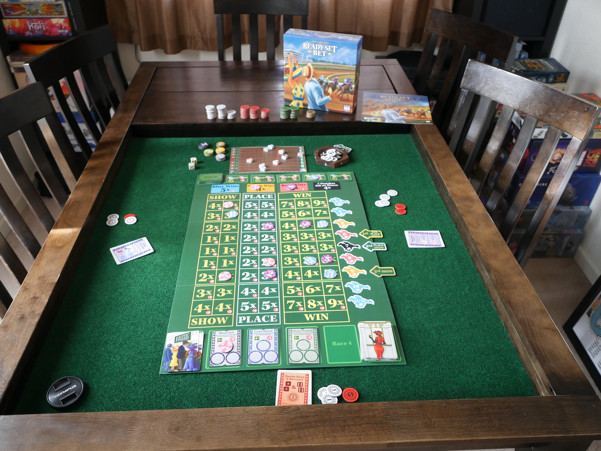

## Introduction

In Ready Set Bet, you and your friends head to the races for a day of cheering, jeering, and betting on your favorite horses, whose fates hang on every roll of the dice.

Ready Set Bet is played over 4 rounds. Each round consists of a race followed by bet resolution. During each race, players freely place their Bet Tokens on the board while the race is going on. After each race, players win or lose money for each of their placed Bet Tokens and then receive a VIP Club Card to help them win more money in the following races. After 4 rounds, the player with the most money wins!

## Playing Ready Set Bet

You can use the following as basic rules to get started.

1. Give each player a bag of $$5$$ player bet tokens.
2. Set up the larger main board in the center of the desk.
3. Use the Companion App to play the game.  Place your bet tokens as the horses run across the track, until a horse crosses the finish line ending the rac or three red horses cross the red line.
4. Pay each player money tokes for their correct bets, based on the number tokens and the multipliers of the corresponding spaces.
5. Now players pay back money to the bank based on the penalties in the red circles for any spaces containing incorrect bets.
6. Repeat steps 3-5, for four total races.  The player with the most money after all four races wins.

### Additional resources
* [Link to rulebook](https://www.alderac.com/wp-content/uploads/2022/04/ReadySetBet_EN_1P_Rulebook_FINAL.pdf)
* [Companion App](https://nomadgames.co.uk/readysetbet)

