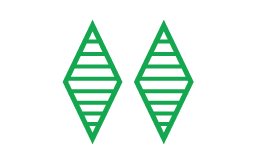

## What is SET

SET is an abstract board game.
The object of the game is to identify a SET of 3 cards from 12 cards placed face up on the table. Each card has four features:

* the **shape** of the symbols, either ovals, squiggles, or diamonds
* the **color** of the symbols, either red, purple, or green
* the **number** of the symbols, either 1, 2, or 3
* the **shading** of the symbols, either solid, striped, or empty

A SET consists of 3 cards in which each of the cards' features, looked at one‐by‐one, are the same on each card, or, are different on each card.
All of the features must separately satisfy this rule.
In other words:
* shape must be either the same on all 3 cards, or different on each of the 3 cards;
* color must be either the same on all 3 cards, or different on each of the 3 cards;
* etc.  See the examples below.

**Example 1:** All have 1 - All different Colors - All different Symbols - All different Shadings

**Example 2:** All different Numbers - All different Colors - All are Ovals - All are Empty

**Example 3:** All different Numbers - All different Colors - All different Symbols - All different Shadings

## How to play SET

* The dealer shuff fles the cards and lays 12 face up on the table (in a rectangle) so that they can be seen by all.
* Players remove SETs of 3 cards from anywhere on the table. Each SET is checked by the other players. If correct, the SET is kept t by the player for one point and the dealer replaces the 3 cards with 3 from the deck.
* A play yer must call SET before picking up the cards. There are no turns, the first player to call SET gets control of the board.
* After he/she has called SET, no other player can pick up cards until that player has finished.
* The SET must be picked up within a few seconds after calling it. If a player calls SET and does s not have one, or if the SET is incorrrect, he/she loses one point, and the 3 cards are returned to the table.
* If all players agree tha at there is not a SET in the 12 cards, 3 more cards are laid face up on the table. The 3 cards are not replaced when the next SET is found, reducing the nummber back to 12.

**Note:** There are ~ 33:1 odds that a SET is present in 12  cards, and ~ 2500:1 odds when 15 cards are on the table.  It is **extremely** unlikely and if you can't find one, you should keep searching.

* The play continues until the deck is depleted. At the end of the game there may be cards remaining that do not form a SET. The number of SETs held by each player is then counted.  One point is given for each SET. High score wins.

