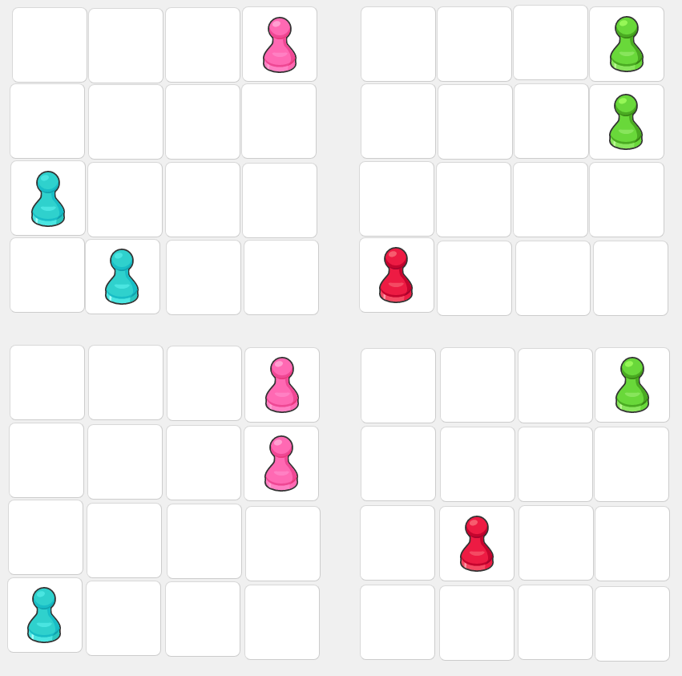

### Problem 1
Consider the following *Shobu* game state

Recall that **Player 2** controls the green and teal pieces while **Player 1** controls the red and pink pieces.
It is Player 2's turn and it looks like they are in trouble on the upper left board.  Is it possible for Player 2 to prevent Player 1 from winning next turn?

### Problem 2

Consider the following *Shobu* game state

* (A) Is Player 1 able to move any of their pieces.  If so, what ones?
* (B) Is Player 2 able to move any of their pieces.  If so, what ones?
* (C) Is there a way for any Player to knock any other players stone off of the board using however many turns?  If so, describe the sequence of turns in detail.  If not, carefully explain why not.

### Problem 3

* Starting with the board set up for a new game, how many moves are there for **Player 1** for their first move?
* Does the number of moves that **Player 2** has for their first move depend on **Player 1**?  If so, describe the number of moves **Player 2** has in terms of the moves that Player 1 can make.

