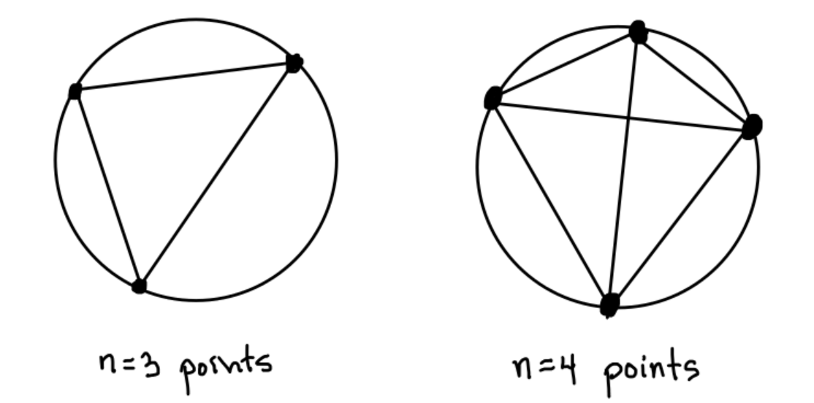
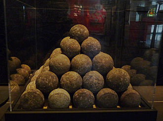

### Problem 1 (Piece of Cake Problem)

A particular friend of mine has a ridiculous method of cutting a cake.  They start by choosing n points on the edge of the cake, and then make a cut for every pair of points on the edge.

For example, the figures below show the way they cut the cake after choosing three points, vs. choosing four points.

Note that the points on the edge of the cage are not necessarily chosen to be equally spaced.  The cake is also not really cut into equitable pieces, but my friend doesn't seem to mind.

* **Question 1A:**  How many pieces is the cake cut into when my friend picks n=3 points?

* **Question 1B:**  How many pieces do we get when we choose n=4 points?

* **Question 1C:**  What is the maximum number of pieces we can get with n=5 well-chosen points?

* **Question 1D:**  Based on the number of pieces we get vs. n, do you have a guess about the number of points for any n?

* **Question 1E:**  Check a higher value of n.  Does it match your guess? If so, try to decide why it might be true, and convince me that it will be true for any value of n.

### Problem 2 (I'm a Lumberjack and I'm Okay)

My other friend is a lumberjack and he's okay.  He sleeps all night and he works all day, so he doesn't have very much time to do math.

Recently he wanted to know the number of different ways you could make a pile of $$n$$ logs of wood, stacked in the usual way, as pictured below

Note that for the stack to be stable, any log on top must be touching two logs beneath (except for the bottom row).  For example, with three logs there are exactly two possible ways to stack the logs (either all flat or one on top.  With four logs, there turns out to be three stacks.  

* **Question 2A:**  Fill out the following table listing the number of ways to stack $$n$$ logs of wood.

| number of logs | number of ways to stack |
| -------------- | ----------------------- |
|       1        |        1                |
|       2        |        1                |
|       3        |        2                |
|       4        |        3                |
|       5        |                         |
|       6        |                         |
|       7        |       15                |
|       8        |                         |
|       9        |                         |

* **Question 2B:**  

A very smart math dude you know says that he thinks he sees a way to get the terms in general.  He says that they come from the **Taylor series** expansion of the function

$$f(x) = \frac{1}{(1-x)(1-x^3)(1-x^4)(1-x^5)^2(1-x^6)^3(1-x^7)^5(1-x^8)^8(1-x^9)^{13}(1-x^{10})^{21}}$$

He notes that the exponents in the function $$f(x)$$ that he observes are satisfying a very famous sequence called the **Fibbonacci sequence**.  Wow!

Use [wolframalpha.com](http://wolframalpha.com) or any other sofware you prefer to calculate the Taylor series of $$f(x)$$.  Alternatively, you can use the following [link to series](https://www.wolframalpha.com/input/?i=%281-x%29%5E%28-1%29%281-x%5E3%29%5E%28-1%29*%281-x%5E4%29%5E%28-1%29*%281-x%5E5%29%5E%28-2%29*%281-x%5E6%29%5E%28-3%29*%281-x%5E7%29%5E%28-5%29*%281-x%5E8%29%5E%28-8%29*%281-x%5E9%29%5E%28-13%29*%281-x%5E10%29%5E%28-21%29+expansion).  You will need to click the **more terms** button to see the bigger coefficients in the expansion.

Check that the coefficents in the expansion are exactly the numbers that you found in the table.

* **Question 2C:**
Continue to check the pattern for $$10$$, $$11$$ and $$12$$ logs.  Does it still hold?

### Problem 3 (Having a Ball or a Blast?)

A friend recently took a trip to Muse historique de Strasbourg (Links to an external site.), where they took the following picture of a cannonball pyramid.  He heard a rumor that French artillery in the Middle Ages were able to tell then number of cannonballs in a pyramid just based on the height!  I went to visit him one day and he had dozens of papers with equations scrawled all over them. He said that he got a blast of divine insight, and found a mathematical formula for the number of balls in a stack which in n balls high:

$$1^2 + 2^2 + 3^2 + (n-1)^2 + n^2 = \frac{n(n+1)(2n+1)}{6}$$

* **Question 3A:**  Check that this formula holds for $$n=3$$, $$n=4$$, $$n=5$$, and $$n=6$$.

* **Question 3B:**  Check a higher value of $$n$$.  Does it match your guess? If so, try to decide why it might be true, and convince me that it will be true for any value of $$n$$.

