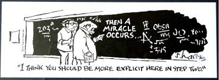

## Introduction
The ability to solve puzzles and problems is an emphatically important skill,
as you will repeatedly experience moving through your mathematical careers.
As we have already seen in this class, and as you will find in upper division
math courses, questions move from the computational to the conceptual.

For example a typical **computational** problem is to calculate the derivative of $$f(x) = x^2\sin(x)$$.
If you follow the basic algorithms for differentiating producs of functions, this is easy.

In a **conceptual** question, we may still be asked to compute something, but the computation itself will rely on leveraging concepts, such as *Theorems* about how things behave, or clever problem solving *strategies*.
Here's an interesting example.

**Problem:**  Let $$N = 1111\dots 1$$ be an integer with $$2020$$ digits, all of which are $$1$$.  Determine (without a calculator) the $$1011$$'th digit after the decimal point of $$\sqrt{N}$$.
To determine the solution of a problem like this, we will need to use various *concepts*, such as potentially rewriting $$N$$ in an illuminating way and applying [Binomial Series](https://en.wikipedia.org/wiki/Binomial_series).  (If you are up for a challenge, try to prove that the answer is $$1$$.)

**Problem:** Another rather famous problem dating back to 1650 was to calculate the value of the infinite sum

$$\sum_{n=1}^\infty \frac{1}{n^2} = 1 + \frac{1}{4} + \frac{1}{9} + \frac{1}{16} + \frac{1}{25} + \dots.$$

This problem remained unsolved for almost a hundred years, until Euler solved it in 1735 by inventing the fundamentally new concept of the *Weierstrass factorization* of $$\sin(x)$$.

In this class, one of our goals is to nuture our inherent problem solving skills by arming ourselves with some useful **strategies of problem solving**.
While we can't guarantee you that they will help you solve a hundred-year-old problem any time soon, they should help you to be mathematically stronger moving forward in all of your future mathematical endeavors.

## General Methods used Every Time
The problem solving strategies we outline in this document fall into two broad categories: things that we should do every time, and more specialized things we can try on various problems.

Here are some things that you should do, no matter what the question you are trying to answer may be:

* **Carefully read and understand the question**
In order to answer the question, we should carefully understand what the question is actually asking.
It seems like a no-brainer but it trips people up so much it's definitely worth mentioning!
In fact, we can take this a bit deeper: when you look at a question you should think about not only what the answer should be, but also why the question is hard or interesting.
This can help us to understand both what strategies may be useful in solving the problem, and also help us to verify that whatever we have actually is a solution.

* **Channel your previous background knowledge**
When you are looking at a problem, you should definitiely think about any sort of previous real world or mathematical knowledge might help you.
Think about, for example, trying to find the length of some side of a triangle.  Maybe we know the other two sides.  Maybe we know an angle.  If it's a right triangle, then we should remember the Pythagorean Theorem!  If it's not a right triangle, then maybe the Law of Cosines could be useful!

## Specific Strategies

* [systematically organize information](strat-organize)
* [rewrite the problem](strat-rewrite)
* [abstractify to essential information](strat-abstractify)
* [reduce the problem to a previously solved problem](strat-reduce)
* [break the problem up into cases](strat-cases)
* [process of elimination](strat-elimination)
* [exploit symmetries](strat-symmetries)
* [targeted guess and check](strat-guess)
* [draw a figure](strat-draw)
* [algebraify](strat-algebraify)
* [use toy examples to find patterns](strat-toy)
* [generalize the problem](strat-general)

