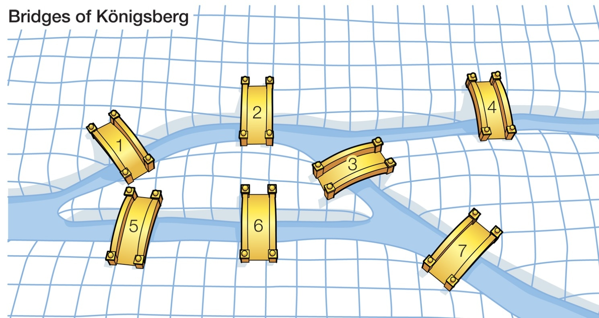
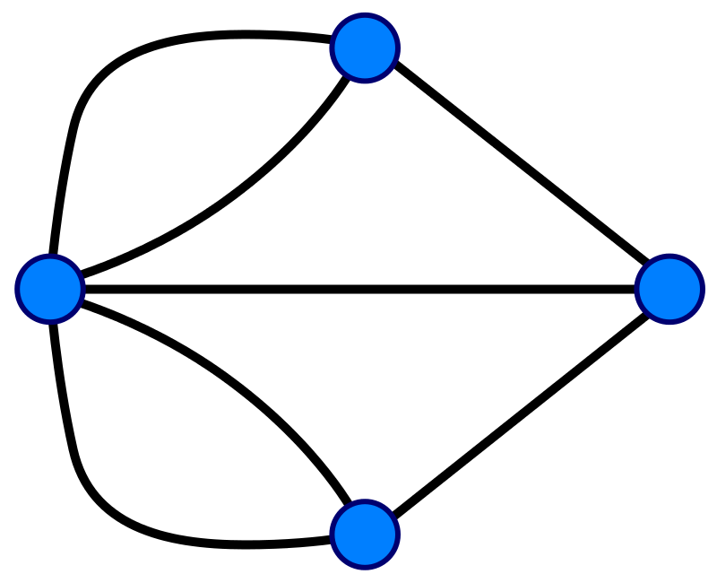

If we can think of a problem in terms of a very simple model or system that keeps only the bits of information that are most essential or relevant to the questions we're trying to answer, it can help illuminate a way forward.

## Example 1

By thinking only about the possible combinations for winning in the Game of 15, we were able to see similarities between it and Tic-tac-toe, and eventually see that the games are equivalent (isomorphic) .

## Example 2

In thinking about Tic-tac-toe, we realized that the only essential information was the number of possible winning combinations that a square had, and the relative positions of marks within those squares. As such, we could use symmetry to identify several possibilities for the first few moves as effectively identical, reducing the number of cases to consider.

## Example 3
**The Konigsberg Bridge Problem**

In the picture above, we have a cartoon version of a very famous problem solved by Euler in 1736.  The question he answered is the following.

Is there a way to cross every single bridge in Konigsberg without crossing any bridge more than once?

In order to analyze this problem, Euler visualized this problem as a graph theory problem.  He let the various bodies of land be represented by vertices, where the bridges are connected by edges.  This produces a graph consisting of four vertices and seven edges as pictured below.

Each vertex (the blue circles) represents one of the land masses in the picture above.  The edges each correspond to a bridge.  For this reason, this particular graph is often called the Konigsberg graph.  The problem then is to find a path on the Konigsberg graph which crosses every single edge once and only once.  Nowadays, paths on graphs which pass through every edge exactly one time are called Eulerian paths.

**Solving the Konigsberg Bridge Problem**

To solve the Konigsberg bridge problem, Euler imagined traveling on a path on the Konigsberg graph which traveled across every edge exactly one time.  He realized that on such a path, except for possibly the vertices that the path begins and ends on, every time he entered a vertex he would have to leave again by a different edge than the one he came in on.  Therefore for all but possibly two of the vertices, there should be an even number of edges touching each vertex! The Konigsberg graph has more than two vertices with an odd number of edges, so it cannot have such a path.  Thus there is no such desirable path through the city of Konigsberg!

