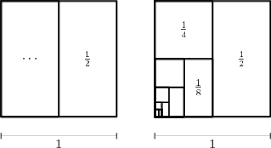

In a lot of problems, we can make some great headway by drawing a picture.

## Example 1

**Problem:**

Calculate the sum

$$\frac{1}{2} + \frac{1}{4} + \frac{1}{8} + \frac{1}{16} + \dots + \frac{1}{2^{2020}}.$$

We think of the sum as gathering up halves of a square

The original area is 1, so our sum will be 1 minus the remaining fraction is $$1 - \frac{1}{2^{2020}}$$.

