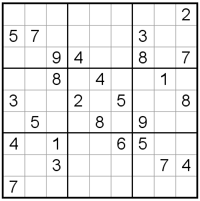

One very familiar strategy to anyone who has ever taken a multiple choice exam is *process of elimination*.

## Example 1 
In the game Sudoku, the objective is to fill in the empty spaces in a Sudoku board with numbers between $$1$$ and $$9$$.
A Sudoku board consists of a $$3\times 3$$ grid of blocks, where each block is further composed of a subgrid of $$3\times 3$$ entries.
The goal is to choose entries so that each number occurs exactly one time in each row, column and $$3\times 3$$ block.

**Problem:**
Determine the value of the entry in the center of the center-right $$3\times 3$$ block of the following Sudoku board.

We know that the entry should be $$1,2,3,4,5,6,7,8,$$ or $$9$$.
Since the center-right $$3\times 3$$ block already has $$1,8,$$ and $$9$$, we can eliminate those.
Also the same row has a $$2,3,$$ and $$5$$ and the column has a $$7$$, so we can eliminate those as well.

Thus we are left with the entry being either $$4$$ or $$6$$.

If the entry is $$4$$, then that forces the upper left entry of the upper right block to be $$4$$, and therefore the center right entry of the upper left block is $$4$$.
However, this means that the lower left entry of the center left block must be $$4$$.  However, that puts two $$4$$'s in the far left column!

Thus we have eliminated $$4$$ and the only possible value for the entry in the center of the center right block is $$6$$.

