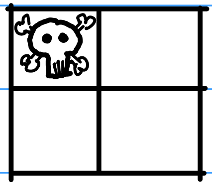

### Chomp
The game **chomp** is played with two players, starting with an $m\times n$ grid of squares forming a chocolate bar.
* The players take turns choosing a block and taking a bite, which removes the chosen block along with all blocks below it, to the right of it, or both.
* On each turn, players must take a bite.
* The top left block is poisoned, and the player who eats this final block loses.

Play the divisor game for a while with various size grids.
Then solve the following problems.

**Problem 1:**

Consider a $$2\times 2$$ Chomp grid.

* (A) Explain why if Player one chooses a square adjacent to the poison square, then Player two will win.
* (B) Explain why if Player one chooses the bottom right square, then they can force a win.

**Problem 2:**

Consider a $$2\times 3$$ Chomp grid.

* (A) Explain why if Player one chooses a square adjacent to the poison square, then Player two will win.
* (B) Suppose that Player one chooses the square in the second row and second column, leading to the game state

Show in detail that Player two can force a win.
* (C) Suppose instead that Player one chooses the square in the second row and third column, leading to the game state

Show in detail that Player one can force a win.

**Problem 3:**

Consider a $$3\times 3$$ Chomp grid.

* (A) Explain why if Player one chooses any square in the first row, then Player two can force a win.
* (B) Explain why if Player one chooses any square in the first column, then Player two can force a win.
* (C) Suppose that Player one chooses the square in the second row and second column, leading to the game state

Show in detail that Player one can force a win.
* (D) Show that if Player one chooses any of the other squares, then Player two will win.

**Problem 4:**

Mathematicians have proved that Player one can force a win.
However, the path to victory is narrow and full of danger: one wrong move and Player two can instead force a victory.
Experienced Chomp players and computer simulations have found that Player one has exactly one perfect opening move -- any other move and Player two can instead force a win!

In the problems above, you discovered the perfect opening move for $$2\times 2$$, $$2\times 3$$ and $$3\times 3$$ boards.
Now try to find the perfect opening move for each of the following boards
* (A) a $$2\times 4$$ board
* (B) a $$3\times 4$$ board
* (C) a $$4\times 4$$ board
* (D) a $$3\times 5$$ board
* (E) a $$4\times 5$$ board

