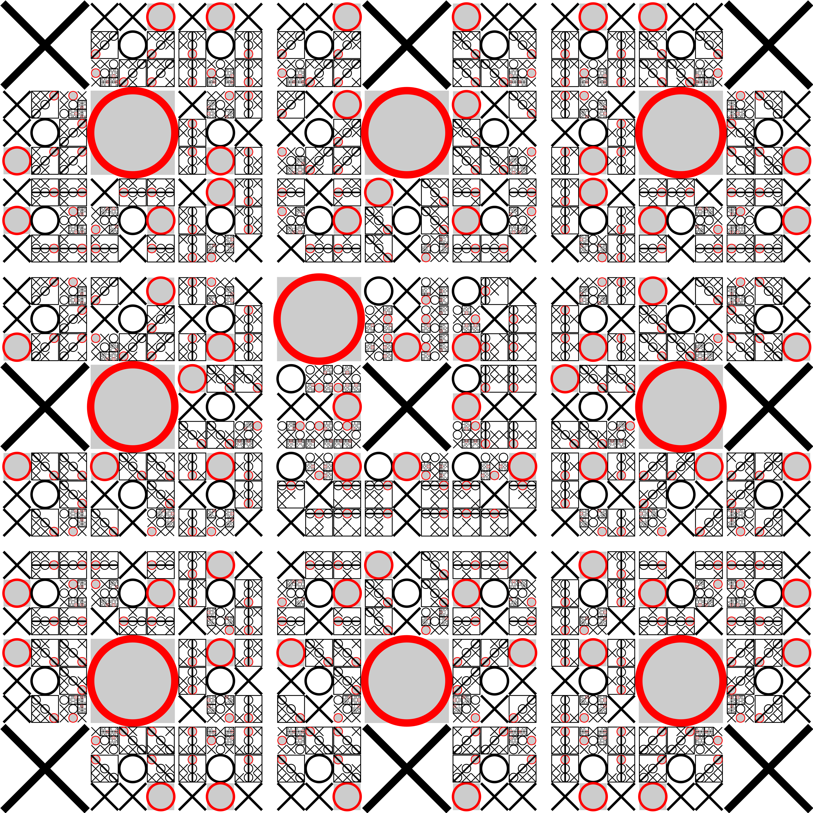

## Introduction

The game **Tic-tac-toe** is familiar to everyone and has its origins in ancient antiquity.
In fact, early variations of the game can be found on Egyptian roofing tiles dated back to $$1300$$ BC!

## Playing tic-tac-toe

To play tic-tac-toe online, we will just use scratch paper and a pen/pencil
To start, follow these instructions.
1. Pick two people to play a game of Tic-tac-toe starting out.  Make sure to help remind anyone who might have forgotten how to play!  Also, every time you make a move, tell the group something new about yourself.
2. After the game is over, choose two new people to play the game.  Cycle through until everyone has had an opportunity to play.  These games should be quick!  Everyone should hopefully get the chance to play after about $$5$$ minutes.
3. Take ten minutes to write down a single set of rules describing how ot play tic-tac-toe.

