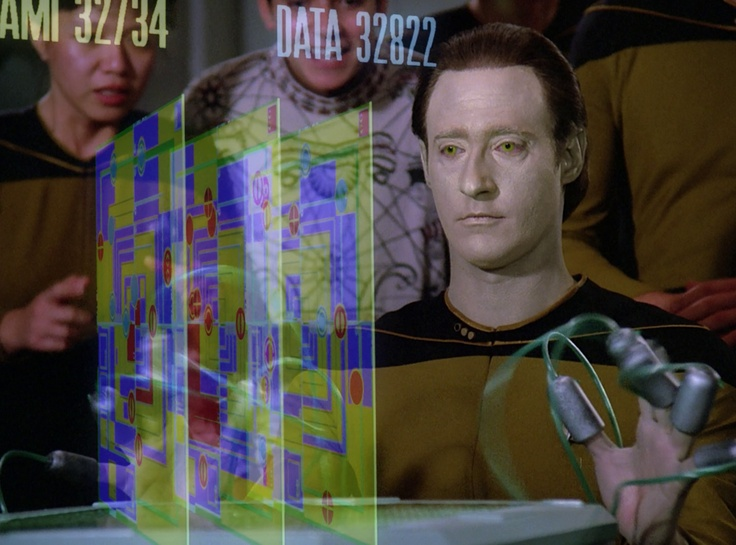

### Perfect play

The term **perfect play** refers to when a player plays a strategy that leads to the best possible outcome for that player, or the most likely best outcome in a probablistic scenario, regardless of the choices of their opponent.

Think, for example, about *tic-tac-toe*.  Can we identify what would be **perfect play** for the player who goes first?
What about the second player?

A game where there is a known definitive strategy for a player to force a win or a draw by playing perfectly in the staring game is called a **solved game**.  As you probably have noted, *tic-tac-toe* is an example of a solved game!  In particular, the first player can always force a draw (or a win if the second player messes up).

However, it turns out there are surprising number of other games out there which are solved, some of which you've probably heard of before!
For example
* *Connect Four* [(strategy-based proof (link))](http://www.informatik.uni-trier.de/~fernau/DSL0607/Masterthesis-Viergewinnt.pdf)
* *Guess Who?* [(probabilistic proof (link))](https://arxiv.org/pdf/1509.03327.pdf)
* *mancala* [($$106$$-day calculation on supercomputer)](https://jabaier.sitios.ing.uc.cl/iic2622/kalah.pdf)
* *checkers* [($$18$$-year long computer calculation)](https://www.theatlantic.com/technology/archive/2017/07/marion-tinsley-checkers/534111/)

What about if you take over a game for a friend in the middle?  Games where a strategy for perfect play is known for *any* given board state are called **strongly solved**.
*Tic-tac-toe* is strongly solved, for example.  So are *Guess Who?* and *Connect Four*.

### Instructions

Describe in precise detail what the perfect strategy is for the first player (*P1*) in $$3\times 5$$ Chomp.
Make sure your strategy clearly describes
* Where *P1* should play first
* Where *P1* should play in response to every possible first move by *P2*
* Where *P1* should play in response to every possible second move by *P2*
* Where *P2* should play in response to every possible third move by *P2* 
* ... and so on

Write down your strategy and then scan and upload it to Canvas.

