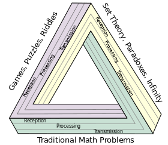

---
#
# By default, content added below the "---" mark will appear in the home page
# between the top bar and the list of recent posts.
# To change the home page layout, edit the _layouts/home.html file.
# See: https://jekyllrb.com/docs/themes/#overriding-theme-defaults
#
layout: home
title: Math 180 Strategies of Problem Solving
---

**Instructor:** Dr. W. Riley Casper [(About your instructor)](instructor)

**Email:** wcasper@fullerton.edu

**Course meetings:**

* Section 3: M,W 3:00PM-4:50AM in MH 390
* Section 4: T,Th 3:00PM-4:50PM in MH 390

**Office hours:** 1-2PM on Tuesday and 12-2PM on Thursday

**Syllabus:** <a target="_parent" href="syllabus.html">Course syllabus (link)</a>

**Rooms for virtual instruction:** <a target="_parent" href="available-rooms.html">List of reserved rooms on campus (link)</a>

**First steps**

Please familiarize yourself with the syllabus and the Canvas site for this course, starting with the <a target="_parent" href="https://csufullerton.instructure.com/courses/3456916/modules/9068583">Orientation Module (link)</a>.  Also, be sure that you have the necessary technological requisites for lectures and office hours:
* A reliable internet connection

Please reach out as soon as possible if you have any questions or concerns.

***

## New posts!

